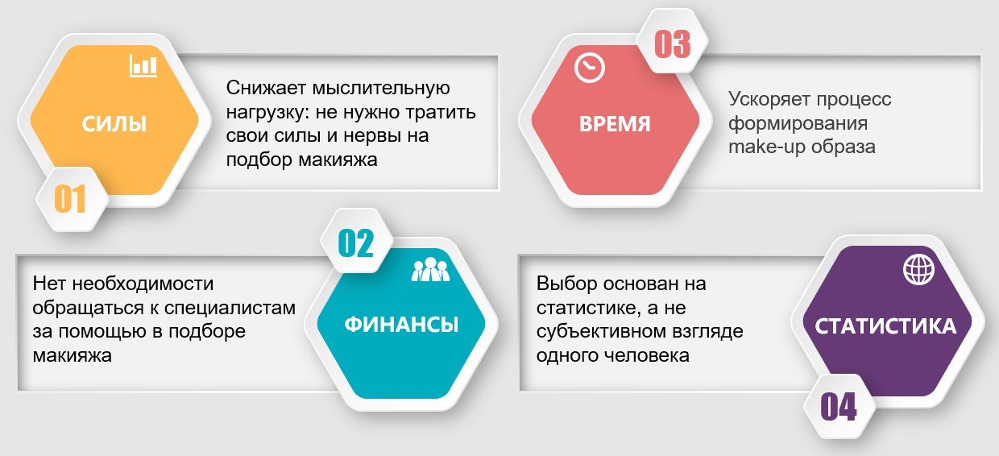

 

Сущность разработки

**Функция**: приложение, которое на основе make-up БД подбирает гармоничную цветовую гамму для макияжа с учётом выбранного оттенка определённого продукта

**Для кого**: люди, заинтересованные в макияже, следящие за трендами, нуждающиеся в подсказках

**Чем облегчает жизнь**: к цвету основного продукта пользователя автоматически подбирается комплекс выгодных цветовых сочетаний, что:

# 

# 

# 

 

Процесс

# 

 

Команда проекта

# 

