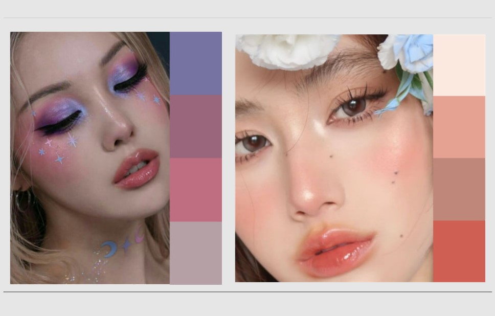

 

Make-up palette

app with AI

 

Сущность разработки

**Функция**: приложение, которое на основе make-up БД подбирает гармоничную цветовую гамму для макияжа с учётом выбранного оттенка определённого продукта

**Для кого**: люди, заинтересованные в макияже, следящие за трендами, нуждающиеся в подсказках

**Чем облегчает жизнь**: к цвету основного продукта пользователя автоматически подбирается комплекс выгодных цветовых сочетаний, что:

*1\. снижает мыслительную нагрузку (муки подбора и выбора)*

*2\. ускоряет процесс формирования make-up образа (несколько секунд/минут)*

*3\. нет необходимости контактировать с консультантами в магазине*

*4\. основан на статистике, а не субъективном взгляде 1 человека*

*5\. позволяет избежать некорректных результатов запроса*

# 

# 

 

# 

 

# 

# Контакты

# 

